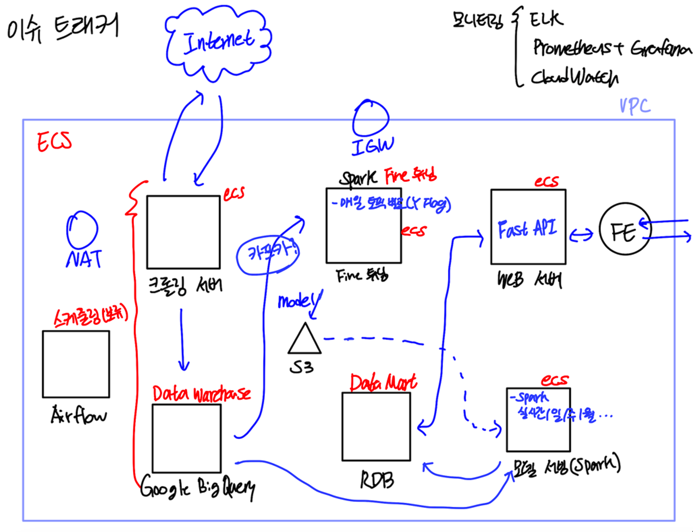
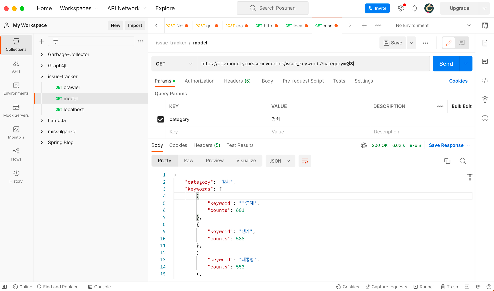
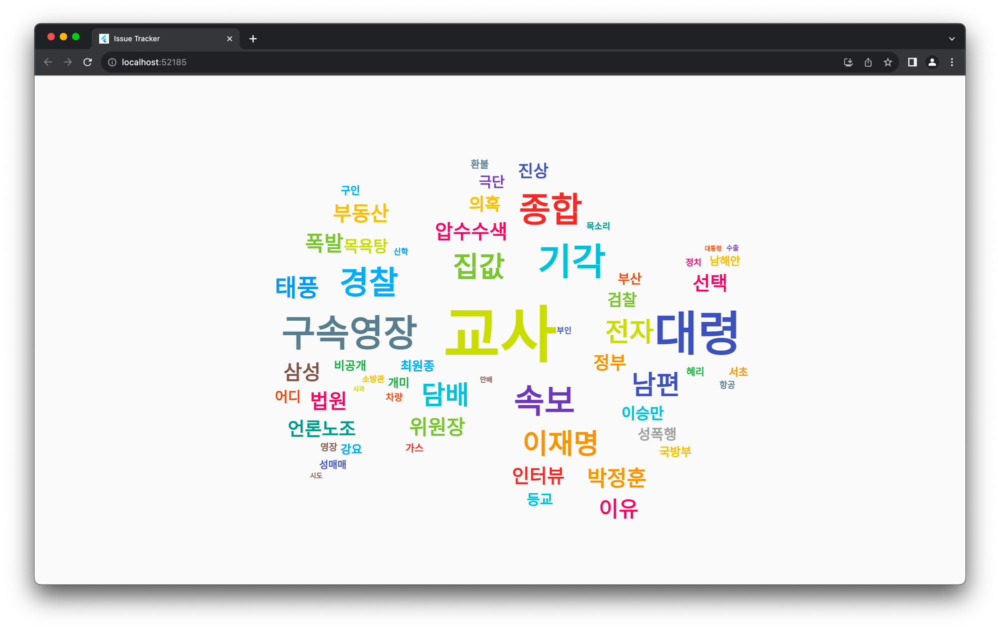
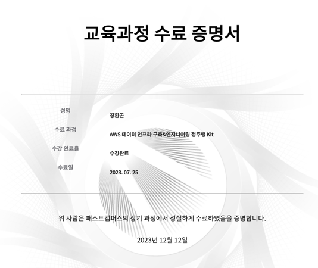

## 패스트캠퍼스 AWS 데이터 인프라 구축&엔지니어링 정주행 Kit 수강후기
데이터 엔지니어링을 공부하기 위해 수강한 패스트캠퍼스 AWS 데이터 인프라 구축&엔지니어링 정주행 Kit 수강후기를 작성합니다.
2023년 4월 데이터 엔지니어로의 커리어를 위해 비싼 가격에도 불구하고 제대로 공부하겠다는 마음으로 해당 강의를 결제하였습니다.

AWS에 대한 전반적인 지식부터 쿠버네티스, msa, 그리고 제가 공부하고 싶었던 다양한 데이터 엔지니어링 기술들(Spark, Airflow, Kafka 등등)을 공부할 수 있었습니다.
처음엔 너무나도 많은 강의의 양에 압도되었지만, 꾸준히 강의를 들으면서 내가 공부하는 분야가 어떻게 이루어지고 있는지, 어떤 기술들을 공부해야하는지를 알 수 있었습니다.

특히, 이 강의를 통해 배운 AWS, 테라폼, 도커, Spark 등의 지식을 이용해 실시간 키워드 분석 프로젝트를 진행했는데, 상당히 만족스러웠습니다.
https://www.notion.so/hwangonjang/efd3ba3cb13540b58ef8026fb132a2d6?pvs=4

데이터 엔지니어로서의 커리어를 만들어나가기 위한 귀중한 초석이 되었고 앞으로도 열심히 공부하기 위해 도움이 되는 패스트캠퍼스의 강의를 애용할 생각입니다!

- 아직 100% 완강은 아니지만 따냈던 수료증!

